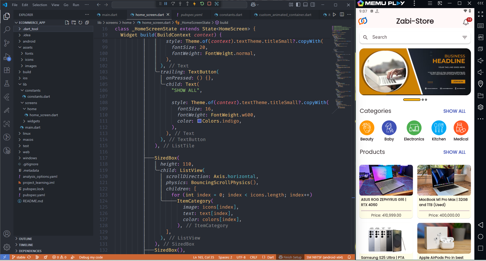
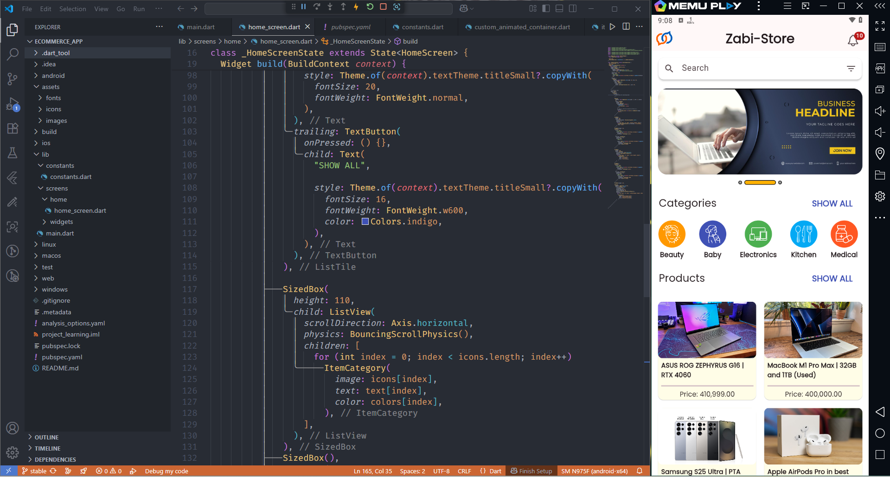
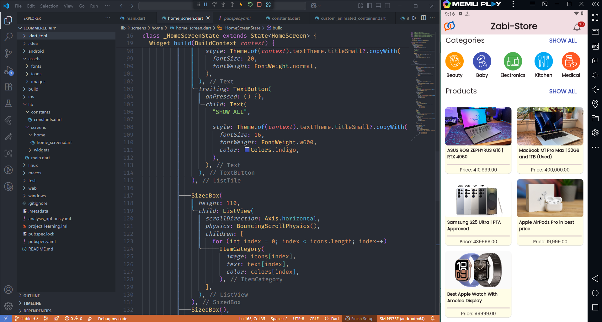
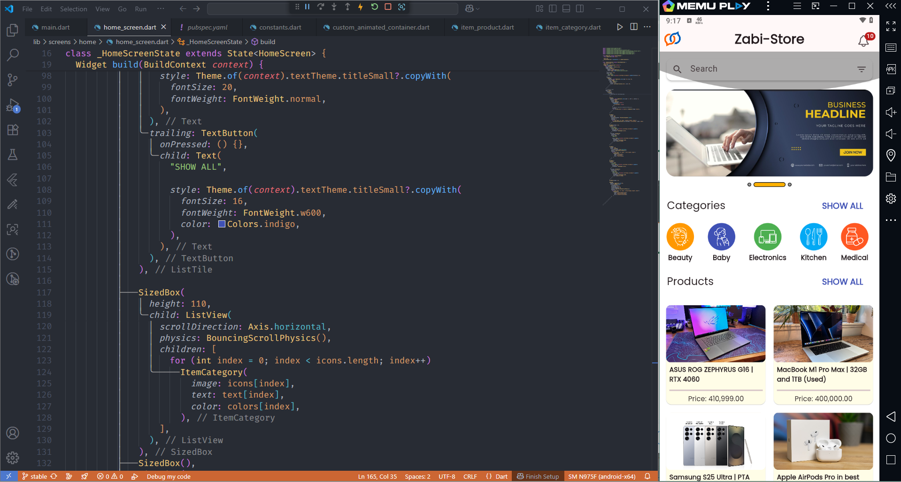

## 📦 Zabi-Store — Flutter E-Commerce App (UI Showcase)

This is the first page of my Flutter app **Zabi-Store**.  
I focused on making the design clean, simple, and user-friendly.  
I also used **custom widgets** and followed the **DRY (Don’t Repeat Yourself)** principle to keep the code neat and easy to manage.

---

## 🖼️ Picture 1: Full Front Page Overview

This is the full view of the app’s front page.

**What’s included here:**
- A top banner (Hero section) to show offers or highlights
- A search bar for finding products
- Categories shown in a scrollable row
- Products displayed in a grid format

The background color is soft (`0xFFFFFDE7`) which makes the page feel warm and comfortable.  
Each part is made with a **custom widget** so it can be reused later easily.

---

## 🖼️ Picture 2: Swiped Banner (Hero Slider)

In this image, the banner at the top is **sliding to the next image** using **PageView**.

**What I did here:**
- Used `PageView` to let users swipe banners
- Below the banner, small **dots** show which banner is In-active.
- The banners that are active are shown in a small bars.
- These dots and small bars are also custom-made (not from a package)
- All banners are part of a custom widget, so they are easy to manage

This makes the top section feel interactive and professional.

---

## 🖼️ Picture 3: Scrolled Down to See All Products

Here, the user has **scrolled down** to the bottom of the page to view more products.

**Details:**
- Products are shown using `GridView.count`
- Each product has an image, name, and price
- All product cards are made from a single `ItemProduct` widget
- Scrolling is smooth and works well with the clean layout

This shows how the app handles longer product lists in a simple and neat way.

---

## 🖼️ Picture 4: Custom Scroll Indicator (Glow Effect)

In this image, the scroll is at the end, and you can see a **glow effect** on scroll.  
Also, the **dots under the banner** work as a scroll indicator.

**What’s custom here:**
- The banner dots were built manually, not using any pre-made library
- The scroll glow effect is shown when reaching the end of the list
- Everything is made using simple Flutter widgets (no extra plugins)

This part shows how the app feels more alive with small touches like these.

---

## 🔁 What I Focused On

### ✅ DRY Principle  
I avoided repeating code. I created **custom widgets** for banners, products, and categories. This made my code clean and easy to update.

### ✅ Reusability  
All parts of the UI are built to be **reused** on other screens like product details, cart, etc.

### ✅ Simple and Clean UI  
I used soft colors, enough spacing, and kept everything balanced. The goal was to make the app easy to look at and easy to use.

---

## 📌 What’s Next

- [ ] Add a product detail page  
- [ ] Create the cart screen  
- [ ] Connect it with Firebase  
- [ ] Add proper state management with Provider or Riverpod

---

## 📣 Thank You!

If you like this UI, or want to give any suggestions, I would love to hear your thoughts.  
I’m still learning, and building this page taught me a lot about **clean design** and **custom Flutter logic**.

---
